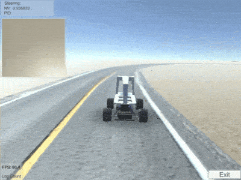
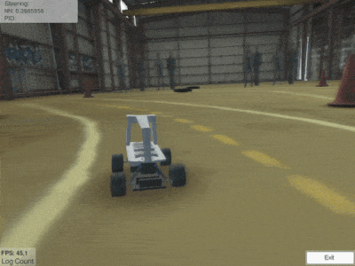
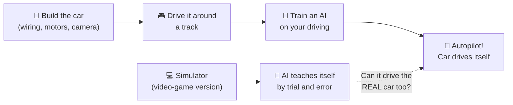

# Let's Build a Car That Drives Itself 🏎️🤖

This is a real RC car that you build and wire up yourself, with a tiny computer and a camera on top. Then you **teach it to drive itself** around a track. Nobody writes rules like "turn left when the line curves." The car learns by watching.

*That's a "Donkey Car." The black arch is a camera mount, the board on top is a Raspberry Pi (a credit-card-sized computer), and underneath it's a normal fast RC car.*

---

## Part 1: The build (your department)

The car is built from parts you can actually understand and change:

| Part | What it does |
|---|---|
| **RC car chassis** | Motors, steering servo, wheels, suspension: the muscles |
| **Raspberry Pi** | The brain. It runs the driving software |
| **Camera** | The eye. It's the *only* thing the car uses to see the road |
| **PWM servo driver board** | Turns the Pi's commands into signals the steering servo and motor controller understand |
| **Buck converter** | Steps the battery voltage down to the 5V the Pi needs |
| **Battery** | Powers everything |

Here's how the electronics connect:

That's real wiring you'd do: power regulation, I²C between the Pi and the servo board, and PWM signals out to the steering and throttle. Once the basic car works, you can add whatever you want: lights, a bumper switch, extra sensors, a better camera mount, a custom 3D-printed body.

---

## Part 2: Teaching it to drive

### Step 1: You drive, it watches

You drive the car around a track, made with tape on the floor, with a game controller or your phone. While you drive, the car saves **thousands of photos from its camera** along with **exactly how you were steering** at each moment.

*What the car "sees" while it's being driven from a phone. Note the "Autopilot" menu on the right.*

### Step 2: Train a brain

A computer looks at all those photos and figures out the pattern: "when the road looks like *this*, steer *that* much." This is a **neural network**, the same basic kind of AI used in real self-driving cars.

### Step 3: Let go of the controls

Flip the switch to **Autopilot** and the car drives itself, copying the way you drove.

**Here's the catch:** the car learns from YOU. If you drive sloppy, it drives sloppy. If you crash a lot, it learns to crash. Good drivers make good robots. 😄

---

## Part 3: The video-game version

There's also a **simulator**, basically a racing video game where the car is a perfect copy of the real Donkey Car. Same camera view, same controls, same software.

In the simulator you can:
- Drive on lots of different tracks: a warehouse, desert roads, real race courses
- Change your car's color and put your name on it
- Crash as much as you want, because nothing breaks 💥
- Race against other people's AI cars

*Two cars in a simulator race. Each car is driven by somebody's AI, and the name floats above it.*

---

## Part 4: The really wild part: a car that teaches *itself*

There's a second way to teach the car. Instead of copying you, it **teaches itself by trial and error**. This is called **reinforcement learning**. It's how AIs learned to beat the world's best players at chess, Go, and video games.

It works like training a dog with treats:
- The car gets **points** for staying on the road and going fast
- It **loses** when it drives off the road
- At first it's *terrible*. It drives straight into the grass over and over
- After a few minutes of practice... this happens:

*This car taught itself to drive in about 5–20 minutes of practice. The little window in the top-left shows the car's compressed version of what its camera sees.*

### The sneaky part: AIs are cheaters 😈

The AI does *whatever gets the most points*, even if that's not what you meant. Tell it "points for not crashing" and it might learn to just... drive super slowly forever. Tell it "points for staying in the middle of the road" and it might wiggle back and forth like a snake.

So the real puzzle is: **how do you write the rules so the AI does what you actually want?** That's a question real AI researchers work on, and you can experiment with it yourself.

---

## Part 5: People race these!

There's a whole community called **DIY Robocars** that holds races. Everyone builds their own car, trains their own AI, and lines up at the start. No humans touch the controls during the race.

*▶ Click to watch: the first outdoor Donkey Car race*

*▶ Click to watch: an AI learning to drive in the simulator in a few minutes (sped up 8×)*

---

## How the whole project fits together

**The big challenge at the end:** can an AI that learned to drive *only in the video game* drive the *real* car on a *real* track? Nobody knows until we try.

---

*Pictures from the [Donkey Car docs](https://docs.donkeycar.com) and Antonin Raffin's [learning-to-drive-in-5-minutes](https://github.com/araffin/learning-to-drive-in-5-minutes) project.*
